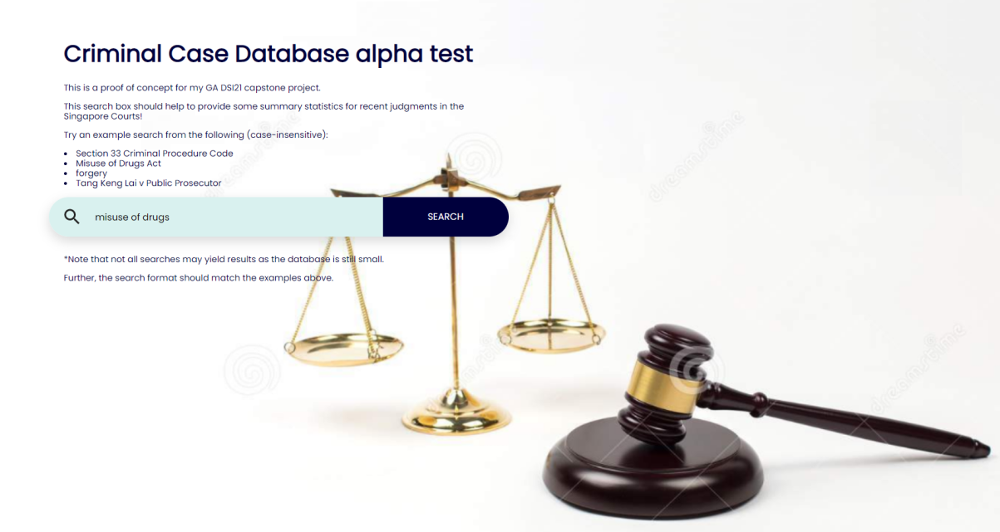
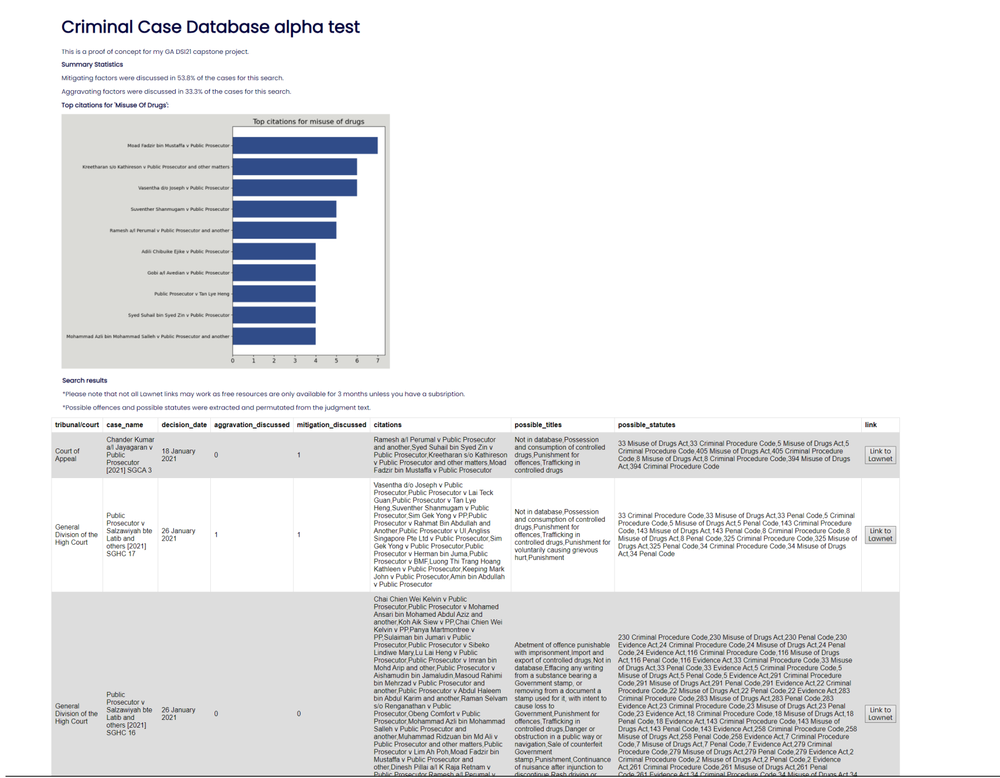

# # Criminal Case Database

** This is an independent project but permissions for the collecting of data from LawNet was given by the Singapore Academy of Law.
The judgments have not been uploaded to this repository as per my agreement with the Singapore Academy of Law. **

** Please do NOT use any of the code or files without permission from me and the Singapore Academy of Law. **

### Problem Statement

Given the current inefficient processes for beginning legal research, this project seeks to create a proof-of-concept on the creation of an Information Retrieval system in the form of a database of Criminal Law Cases which includes statistical summaries, and legal citations to improve on the speed and efficiency of legal research.

This project will use Natural Language Processing (NLP) to capture the relevant details of each judgment to create a database which can be filtered to provide not only the cases and other relevant cases, but also a statistical summary of the other cases cited in the judgment and other factors such as mitigation or aggravating factors in order to allow faster research which is also more data driven.

The project is intended to be a proof of concept on using data science to increase the efficiency of legal research through the use of statistical summaries and data analysis.

---
### Background

Singapore uses the Common Law legal system, where there is an importance of judicial precedents. This means that judges decide cases based on past decisions of the courts. The decisions of higher courts such as the Supreme Court are binding on the lower courts.
Further to past decisions, in Criminal Law, there is a Penal Code and Criminal Procedure Code which creates a statutory framework for investigation, trials, and sentencing in Criminal Law Cases.  

The start of legal research tends to be a slow, manual, and inefficient process. Given the facts of the case at hand, the lawyer first analyzes and determines the relevant area of law to start the research.  
According to a survey done by the ALL-SIS Task Force on Identifying Skills and Knowledge for Legal Practice in 2013, more than half the respondents frequently started their legal research by either looking through statutes or through a case law database, while slightly more than a third would frequently start their research through consulting a subject-specific guide.[1]  
In the current state of the industry, this starting point can take a long time as the statutes and subject-specific guides tend to be wordy, and the case law databases contain many judgments which require further inspection to narrow down according to the case at hand.  

---
### Data Dictionary

The dataset which I manually created is as follows:-

* statutes.csv  

The data dictionary for the dataset is as follows:-

|Name|Type|Dataset|Description|
|:---|:---|:---|:---|
|**statute**|*object*|statutes.csv|Name of the Statute|
|**link**|*url*|statutes.csv|url of the Statute|

The datasets created through webscraping Lawnet are as follows:-

* subordinatecourt.csv
* subordinatecourt_compiled.csv 
* statecourt.csv 
* statecourt_compiled.csv

The data dictionary for the Lawnet datasets are as follows:-

|Name|Type|Dataset|Description|
|:---|:---|:---|:---|
|**court**|*object*|subordinatecourt.csv, subordinatecourt_compiled.csv, statecourt.csv, statecourt_compiled.csv|Court instance|
|**date**|*datetime*|subordinatecourt.csv, subordinatecourt_compiled.csv, statecourt.csv, statecourt_compiled.csv|Decision date of the judgment|
|**title**|*object*|subordinatecourt.csv, subordinatecourt_compiled.csv, statecourt.csv, statecourt_compiled.csv|Case name|
|**link**|*url*|subordinatecourt.csv, subordinatecourt_compiled.csv, statecourt.csv, statecourt_compiled.csv|url of the judgment|

The dataset created through webscraping Singapore Statutes is as follows:-

* statutes_crimes.csv  

The data dictionary for the Singapore Statutes dataset is as follows:-

|Name|Type|Dataset|Description|
|:---|:---|:---|:---|
|**section**|*object*|statutes_crimes.csv|The statute section|
|**title**|*object*|statutes_crimes.csv|The statute title|
|**link**|*url*|statutes_crimes.csv|url of the statute section|
|**statute**|*object*|statutes_crimes.csv|Name of the Statute|
|**section_statute**|*object*|statutes_crimes.csv|Combination of `section` and `statute`|

The datasets created through NLP are as follows:-

* database.csv
* database_temp.csv  

The data dictionary for the datasets created through NLP are as follows:- 

|Name|Type|Dataset|Description|
|:---|:---|:---|:---|
|**case_name**|*object*|database.csv|Case name|
|**tribunal/court**|*object*|database.csv|Court of judgment|
|**decision_date**|*object*|database.csv|Decision date of the judgment|
|**possible_offences**|*object*|database.csv|Possible offences discussed in the judgment|
|**possible_statutes**|*object*|database.csv|Possible statutes discussed in the judgment|
|**citations**|*object*|database.csv|Other cases discussed or cited in the judgment|
|**mitigation_discussed**|*object*|database.csv|Whether mitigating circumstances were discussed in the judgment|
|**aggravation_discussed**|*object*|database.csv|Whether aggravating circumstances were discussed in the judgment|

---
### Webscraping Lawnet

For the webscraping of judgments from LawNet, I will be using a custom class `Court` which has methods and functions created to do the following:  
1. Identify the last page of the website as there are multiple pages of entries
2. Create a dataframe of all cases which belong to criminal law, including their links
3. Identify new cases which are not in my database
4. Update the database
5. Save each judgment as a .html file (as there is a 3 month free resource limit, this is to enable myself to have more data for the project.)

The code worked without any errors, the judgments were successfully archived as .html files for processing with NLP.

Webscraping to archive the .html files of the judgments was less complicated than I had first imagined as it would be. The process of identifying the structure of the html code to iterate through each page to save the cases and urls, as well as to iterate through each url to save the html file was a fun process which made full use of my logical thinking skills.

----
### Webscraping Singapore Statutes

Criminal offences in Singapore are not listed in a central database or statute, but found within many different statutes. Given the vast number of statutes where criminal offences can be found, I will limit the scope to the some of the statutes in Singapore based on criminal offences as listed in [Gloria James-Civetta & Co's article on Singapore Crimes and Punishment](https://www.singaporecriminallawyer.com/crimes-punishment/)[2].

Due to each statute being different and full of nuances, I will manually create databases of crimes from each of the statutes which are available from [Singapore Statutes Online](sso.agc.gov.sg).  

This database of possible criminal offences will be used for the information retrieval as one of the items for the NLP identification is the criminal offence in each judgment.

However, having performed the above filtering of sections from the statutes manually, it becomes all the more apparent how useful Machine Learning will be in the legal industry.  

It took me roughly 6 hours over 3 days to manually filter the sections which contained offences out of the 18 statutes and add them into dataframes.  

Worthy of a project itself, it would be interesting to explore the use of NLP to identify sections prescribing criminal offences and sections containing their corresponding punishments from the various statutes in order to create a comprehensive database of criminal offences in the statutes of Singapore.

The webscraping portion of the code has achieved a 100% pulling and archival rate, as no judgments were missed out.

---

### Natural Language Processing

Rule-based Information Extraction (RBIE) was used instead of Named Entity Recognition (NER) due to the limited amount of time and data to pre-tag judgments and train the model.

In RBIE, a set of rules (or multiple sets of rules) is used for the identification of patterns which match the rules in order to extract the information. It is a more transparent method as the rules are clearly defined, and it can be maintained easily.

The following information was extracted through the use of NLP:  

* Case name  
* Court of judgment  
* Decision date  
* Possible offences discussed in the judgment 
* Possible statutes discussed in the judgment  
* Cases cited in the judgment  
* Whether mitigating circumstances were discussed  
* Whether aggravating circumstances were discussed  

Once again, I created a custom class `Database` which has methods for the following:  
1. Calculate the number of rows for each `court` class in the final database, and in their respective court judgment databases  
2. Identify the number of new rows to set a start and end point for the NLP  
3. Extract the various information from the judgment based on sets of rules   
4. Update and save the final database with the information from new judgments 

Overall, the RBIE system that I created ran well without an errors. It was able to extract information for most judgments accurately, except for a few missing values in the columns `citations`, `possible_offences`, and `possible_statutes`.  

However, I checked the judgments with missing `citations` and `possible_statutes`, and found that only the case name was mentioned in those judgments, with no other case citations or statutes found within, hence this is not an issue with the NLP. 

I manually did a random sample of judgments and found that the true positive rate for information extraction is close to 100%, although the permutations method causes a lot of non-existent statutes to be listed as `possible_statutes`. This is acceptable as it is more important to reduce type II errors (false negatives) where statutes wich are present are missed out.

There are many instances where the `possible_offences` are `Not in database`. This is likely because the NLP uses permutations for statutes which are sometimes found separately from the section number, and the database of `statutes_crimes` is very limited and should be expanded as an improvement to the project.

This however, still suggests that the use of RBIE is not perfect, using a brute-force method that causes some wrong data to be captured.   

---

### Search Function  

The goal of the project is to create a database where users can search for and be shown judgments based on different criteria such as statutes, crimes, or case names.  

Hence it will be necessary to write some functions to allow this searching of the database.  

Regular expressions such as those used in the NLP system will be used as rules to classify the searches to appropriately match within the different columns of the database.

The functions seemed to work well and the expected statistics, dataframe, and plot were returned. The results all contained the search terms in the correct column.

Hence the search engine seems to be a success.

---

### Flask and Google App Engine

Once again, the goal of the project is to create a database where users can search for and be shown judgments based on different criteria such as statutes, crimes, or case names.

Thus, I decided to implement a web app where other uses can test the search functions.

There are many ways for web implementation of python code, but I decided to use Flask and Google App Engine (GAE) for the deployment of my code.

The process to setup the python code as a Flask and subsequently GAE app was challenging in the beginning as I did not understand the core concepts. However, after a bit of tinkering around and following online guides such as the [Martin Breuss's guide on RealPython](https://realpython.com/python-web-applications/#build-a-basic-python-web-application)[3] and [James Asher's guide to showing matplotlib plots](https://towardsdatascience.com/how-to-easily-show-your-matplotlib-plots-and-pandas-dataframes-dynamically-on-your-website-a9613eff7ae3)[4], I managed to successfully deploy the app to GAE.  

  
Sample `index.html` page

  
Sample `results.html`  

This was overall a learning experience, with valuable skills learnt in app deployment for python code.

---

### Conclusion

The webscraping and archival functions worked well, and achieved a 100% collection and archival rate, with no judgments missed. Further, the using a Rule-Based Information Extraction method, the Natural Language Processing of the judgments was quite successful as most of the data which I set out to collect was collected without any issues.  

A manual sample check of judgments showed that the NLP returned a true positive rate of near 100%.

However, there were a few missing values for `citations`, `statutes`, and `offences` as they were not actually in the judgments as well.  

The search function also worked well and returned the expected search results for the searches I tested.  

Further, the app was successfully deployed through Flask and Google App Engine.  

Thus overall, I would conclude that the project has been successful in showing a proof of concept of the use of NLP to provide statistical summaries through data analysis of legal judgments which can be presented in a search engine for legal cases.

---

### Recommendations

If it does not already exist, it may be possibly recommended for legal judgments to be processed through NLP to create tags for case database search engines, as it was quite efficient for my own simple search function.

Further, through the use of NLP and data analysis, I was able to not only find out which cases were discussed in the judgments, but to also identify and present the top cited cases for the different searches.

This can prove to be a very useful feature for legal research, as cases which are cited more often are likelier to have important judicial precedents and relevance.

---
### Future Improvement

Although the NLP worked well, it is not perfect as it uses a Rule-Based Information Extraction method. The html structure may change, and the code is not transferrable to other legal judgment sources and databases. It can definitely be improved through the use of training a Named Entity Recognition Model with Machine Learning which can identify the different categories of Named Entities within the judgment.

It should also be expanded to identify further statistical information such as the sentences given upon conviction, which would provide interesting insights.

The use of a permutation method also caused extra information which was not actually found in the judgments to be captured for `possible_statutes` and `possible_titles`. It would be worthwhile to explore how NER might help to solve this issue.

The database of statutes and offences can also be expanded to feature more sections and statutes. Further, it would also be worth exploring the use of NLP to create a comprehensive database of the various sections of each statute as this can be relevant to legal research.

---
### References

[1] ALL-SIS Task Force on Identifying Skills and Knowledge for Legal Practice, *'A Study of Attorneys' Legal Research Practices and Opinions of New Associates' Research Skills,'*, June 2013. [Online]. Available: [https://www.aallnet.org/allsis/wp-content/uploads/sites/4/2018/01/final_report_07102013.pdf](https://www.aallnet.org/allsis/wp-content/uploads/sites/4/2018/01/final_report_07102013.pdf) [Accessed: May. 6, 2021].

[2] Glora James-Civetta & Co, Advocates & Solicitors, *'Crimes Punishment'*, 2020. [Online]. Available: [https://www.singaporecriminallawyer.com/crimes-punishment/](https://www.singaporecriminallawyer.com/crimes-punishment/) [Accessed: May 8, 2021].

[3] Martin Breuss, *'Python Web Applications: Deploy Your Script as a Flask App,'* Feb 1 2021. [Online]. Available: [https://realpython.com/python-web-applications/#build-a-basic-python-web-application](https://realpython.com/python-web-applications/#build-a-basic-python-web-application) [Accessed: June 4, 2021].

[4] James Asher, *'How to Easily Show Your Matplotlib Plots and Pandas Dataframes Dynamically on Your Website,'* Feb 10 2021. [Online]. Available: [https://towardsdatascience.com/how-to-easily-show-your-matplotlib-plots-and-pandas-dataframes-dynamically-on-your-website-a9613eff7ae3](https://towardsdatascience.com/how-to-easily-show-your-matplotlib-plots-and-pandas-dataframes-dynamically-on-your-website-a9613eff7ae3) [Accessed: June 6, 2021].

---
